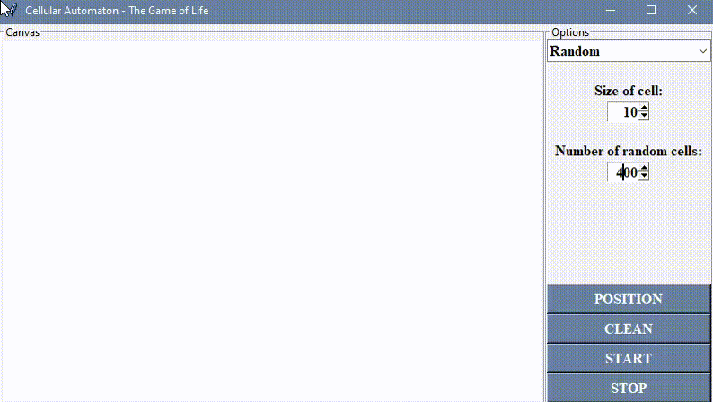

# Cellular Atomata - The Game of Life

To create this project we use Python.

## Description

This is simple Python project with GUI. GUI is implemented by the use of tkinter library.

## Visuals

## Installation

Put this files in a separate folder. 

And if you use PyCharm you should create a new project in this folder.